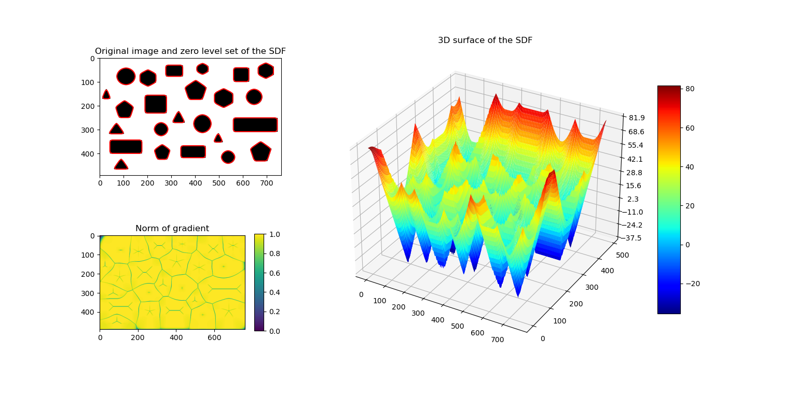
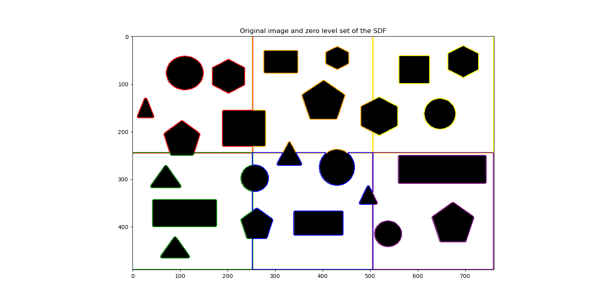
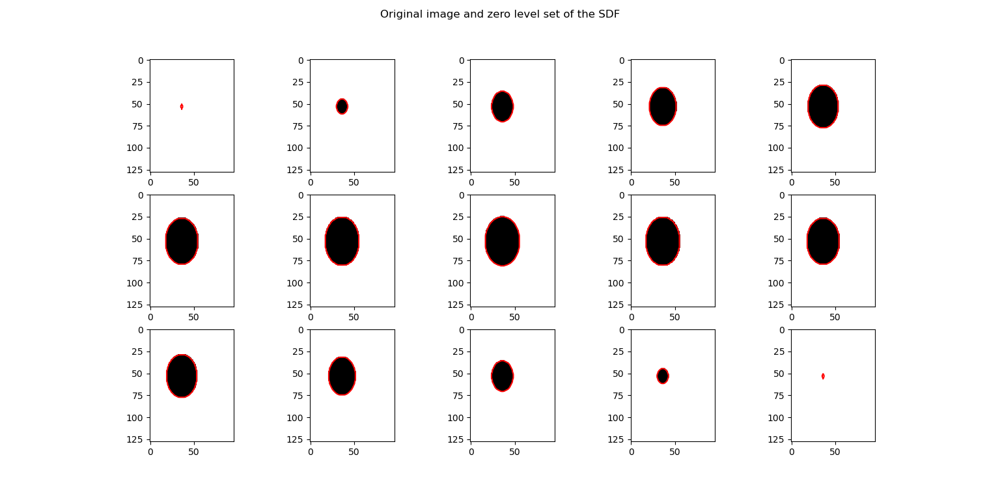

# A classical re-initialization method for level set function

## Overview
This is a python implementation of the Sussman's re-initialization method, in which 3D version is added.

## Referance
[A Level Set Approach for Computing Solutions to Incompressible Two-Phase Flow, Mark Sussman, Peter Smereka, Stanley Osher, Journal of Computational Physics, Volume 114, Issue 1, 1994, Pages 146-159.](<https://doi.org/10.1006/jcph.1994.1155>)

## Example
- Test image (491 x 761)
    
     </img>

- Result

     </img>

- Test patches in 2D SDF mode (245 x 253 x 6)

     </img>

- Test patches in 3D SDF mode (128 x 96 x 15)
    
     </img>